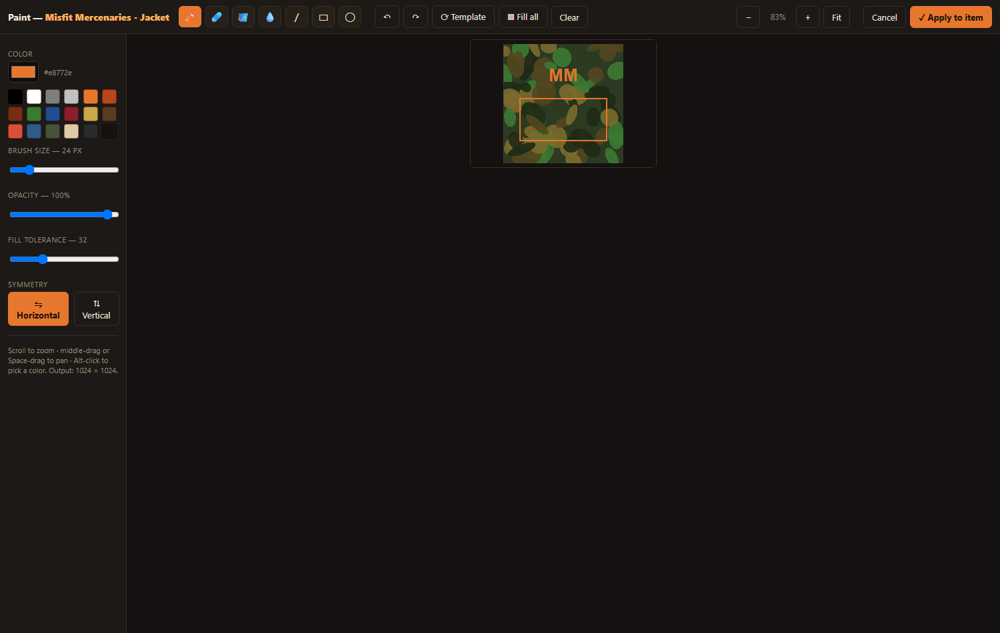

<h1> Kitbash</h1>

**Reskin any DayZ item.** A single-file, browser-based GUI for building custom
DayZ clothing & gear retexture mods — pick a base item, set its stats, drop in a
texture, and Kitbash generates the `config.cpp`, `types.xml`, and a build script
that packs a ready-to-deploy PBO.

No Workbench, no hand-editing configs. Just a photo edit and a few clicks.


> Not affiliated with or endorsed by Bohemia Interactive. **No game assets are
> included in this repository** — see [UV templates](#uv-templates-optional).

---

## Features

- **202 vanilla base items** across jackets, shirts, pants, vests, headgear,
  masks, gloves, shoes, backpacks, belts, glasses, and containers — pulled
  straight from the game configs (accurate class names).
- **Modded bases** — inherit from any other mod's item by typing its class name
  and required addon.
- **Per-item stats** — cargo size, heat isolation (thermals), melee/firearm
  armor, weight, item size, visibility, and **durability** presets.
- **Advanced / "Special" items** — custom `.rvmat` materials (glow/emissive),
  attachments, hidden selections, and full `DamageSystem` damage tiers.
- **Full modded-clothing configs** — author or import complete custom items
  (custom `model` + ClothingTypes, inventory/itemInfo wiring, **proxy/attachment
  slots**, `GlobalArmor`, repair, `ContinuousActions`, custom `healthLevels`),
  not just retextures. See [Modded clothing & proxies](#modded-clothing--proxies).
- **Placeable crates & containers** with custom cargo.
- **Built-in paint editor** — an MS-Paint-style editor right inside the tool:
  load the vanilla UV layout as your canvas and paint it live (brush, eraser,
  fill bucket, fill-all, line/rect/ellipse, eyedropper, **horizontal/vertical
  symmetry**, undo/redo, zoom/pan, color swatches, opacity). **Copy / Paste /
  Export PNG** lets you reuse a pattern across a whole set (e.g. a camo
  jacket+pants+vest). Then apply it straight to the item — no external editor.
- **Paint-over UV templates** — or download the real vanilla UV layout to paint
  in Photoshop/GIMP and re-import.
- **`types.xml` generator** so your items actually spawn in the central economy.
- **Import an existing `config.cpp`** to edit and extend a mod you already have.
- **In-app Help** (`? Help`) explaining the workflow and what the tool can/can't do.
- **Autosave** (nothing is lost on reload) and **live validation**.
- **One-click build** — exports the mod folder + a `build.ps1` that converts
  PNG→PAA and packs (optionally signs) the PBO using your DayZ Tools install.

The built-in paint editor — load the UV template and paint it live:



The built-in `types.xml` generator so your items spawn in the central economy:


## Requirements

- Windows
- A modern Chromium browser (Edge / Chrome) — needed for the "export to folder"
  feature; other browsers fall back to a `.zip` download.
- [Python](https://python.org) (only to serve the page locally — see below)
- For building the PBO: **DayZ** and **DayZ Tools** (both free on Steam)

## Quick start

```
git clone https://github.com/meccmax/dayz-kitbash.git
cd dayz-kitbash
```

Then either:

- **Double-click `run.bat`** — serves the app at `http://localhost:8780` and
  opens it in your browser, or
- run it yourself:
  ```
  python -m http.server 8780 --bind 127.0.0.1
  ```
  and open <http://localhost:8780>.

> Serving over `localhost` (rather than opening `index.html` directly) is
> required so the browser can load templates and write the export folder.

## UV templates (optional)

The paint-over templates are the **vanilla DayZ color textures** — Bohemia
Interactive's assets — so they are **not** distributed here. Generate them
yourself, once, from your own game install:

```powershell
.\build-templates.ps1
```

This extracts every clothing/gear `*_co` texture from your DayZ PBOs (via DayZ
Tools' `BankRev` + `ImageToPAA`) into `templates/` and writes an `index.json`
the app reads. Re-run after a game update. Use `-Size 1024` for smaller files.

## Building your mod

1. Build items in the UI and attach textures.
2. **Export Mod** — pick an output folder; Kitbash writes `<ModName>/config.cpp`,
   your PNGs, and `build.ps1`.
3. In that folder, run:
   ```powershell
   .\build.ps1
   ```
   It auto-detects DayZ Tools, converts PNG→PAA, and packs the PBO into
   `@<ModName>/addons`. Enable signing in the Project tab if you want a `.bikey`.
4. (Optional) Merge the generated `types.xml` into your mission so the items
   spawn as loot.

## Modded clothing & proxies

Kitbash is a **config + texture** tool. It generates `config.cpp`, `types.xml`,
and organises your textures — it does **not** create 3D models. That distinction
matters most for proxies.

A "proxy" (a holster, sheath, NVG mount, grenade slot…) has two layers:

| Layer | What it is | Kitbash? |
|---|---|---|
| **Config** | the `attachments[]` slots an item exposes | ✅ **Yes** — *Advanced → Attachments / proxy slots*, and the importer reads them |
| **Model** | the proxy *point* baked into the item's `.p3d`, made in Object Builder | ❌ **No** — that's a modeling step |

So in practice:

- **Reskinning / restatting an item that already has proxies** (a vanilla base, or
  a modded base you inherit from): **fully supported** — the slots come along, or
  you set them in the Attachments field.
- **Authoring a full custom-model item** (your mod ships its own `.p3d`): use
  **Advanced → Full modded-clothing config**. Set the `model` path, ClothingTypes,
  inventory slot, proxy/attachment slots, `GlobalArmor`, repair, `ContinuousActions`,
  custom `healthLevels` (via a damage-rvmat root), and Kitbash writes the whole
  config **around a model you supply**. You bring the `.p3d`; Kitbash does the config.
- **Adding a brand-new proxy point to a model that lacks one**: not possible here —
  that requires the model in Object Builder.

**Import** an existing mod's `config.cpp` (e.g. a custom-clothing mod) and Kitbash
round-trips all of the above so you can edit and re-export it. (Textures and
`.rvmat` files live outside the config, so re-attach those before exporting.)

There's an in-app **`? Help`** button that summarises all of this.

## Security

Kitbash is fully offline and client-side — **no network requests, no telemetry,
no third-party dependencies**, and the PowerShell scripts only call your own DayZ
Tools. See **[SECURITY.md](SECURITY.md)** for the full security review, findings,
and how to verify it yourself.

## License

[MIT](LICENSE) © meccmax

DayZ is a trademark of Bohemia Interactive a.s. This tool is an unofficial,
community-made utility and ships none of the game's assets.
