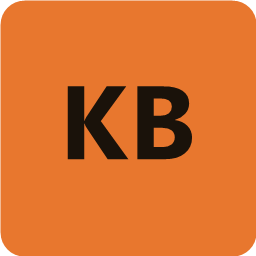
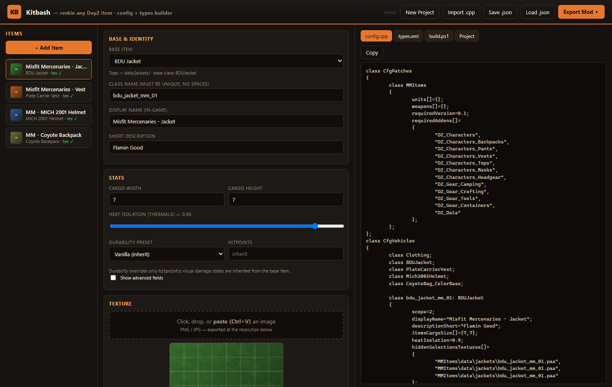
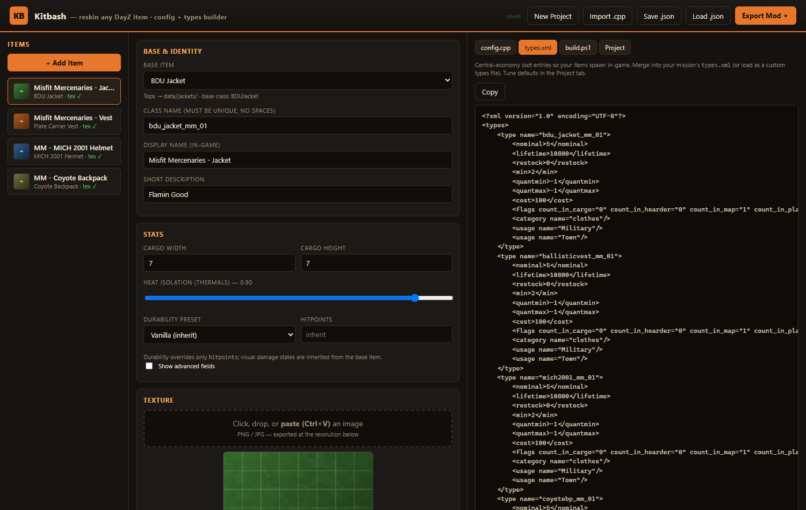

<h1> Kitbash</h1>

**Reskin any DayZ item.** A single-file, browser-based GUI for building custom
DayZ clothing & gear retexture mods — pick a base item, set its stats, drop in a
texture, and Kitbash generates the `config.cpp`, `types.xml`, and a build script
that packs a ready-to-deploy PBO.

No Workbench, no hand-editing configs. Just a photo edit and a few clicks.



> Not affiliated with or endorsed by Bohemia Interactive. **No game assets are
> included in this repository** — see [UV templates](#uv-templates-optional).

---

## Features

- **202 vanilla base items** across jackets, shirts, pants, vests, headgear,
  masks, gloves, shoes, backpacks, belts, glasses, and containers — pulled
  straight from the game configs (accurate class names).
- **Modded bases** — inherit from any other mod's item by typing its class name
  and required addon.
- **Per-item stats** — cargo size, heat isolation (thermals), melee/firearm
  armor, weight, item size, visibility, and **durability** presets.
- **Advanced / "Special" items** — custom `.rvmat` materials (glow/emissive),
  attachments, hidden selections, and full `DamageSystem` damage tiers.
- **Placeable crates & containers** with custom cargo.
- **Paint-over UV templates** — load the real vanilla UV layout under your
  texture on the canvas, or download it to paint in your editor.
- **`types.xml` generator** so your items actually spawn in the central economy.
- **Import an existing `config.cpp`** to edit and extend a mod you already have.
- **Autosave** (nothing is lost on reload) and **live validation**.
- **One-click build** — exports the mod folder + a `build.ps1` that converts
  PNG→PAA and packs (optionally signs) the PBO using your DayZ Tools install.

The built-in `types.xml` generator so your items spawn in the central economy:



## Requirements

- Windows
- A modern Chromium browser (Edge / Chrome) — needed for the "export to folder"
  feature; other browsers fall back to a `.zip` download.
- [Python](https://python.org) (only to serve the page locally — see below)
- For building the PBO: **DayZ** and **DayZ Tools** (both free on Steam)

## Quick start

```
git clone https://github.com/<you>/kitbash.git
cd kitbash
```

Then either:

- **Double-click `run.bat`** — serves the app at `http://localhost:8780` and
  opens it in your browser, or
- run it yourself:
  ```
  python -m http.server 8780 --bind 127.0.0.1
  ```
  and open <http://localhost:8780>.

> Serving over `localhost` (rather than opening `index.html` directly) is
> required so the browser can load templates and write the export folder.

## UV templates (optional)

The paint-over templates are the **vanilla DayZ color textures** — Bohemia
Interactive's assets — so they are **not** distributed here. Generate them
yourself, once, from your own game install:

```powershell
.\build-templates.ps1
```

This extracts every clothing/gear `*_co` texture from your DayZ PBOs (via DayZ
Tools' `BankRev` + `ImageToPAA`) into `templates/` and writes an `index.json`
the app reads. Re-run after a game update. Use `-Size 1024` for smaller files.

## Building your mod

1. Build items in the UI and attach textures.
2. **Export Mod** — pick an output folder; Kitbash writes `<ModName>/config.cpp`,
   your PNGs, and `build.ps1`.
3. In that folder, run:
   ```powershell
   .\build.ps1
   ```
   It auto-detects DayZ Tools, converts PNG→PAA, and packs the PBO into
   `@<ModName>/addons`. Enable signing in the Project tab if you want a `.bikey`.
4. (Optional) Merge the generated `types.xml` into your mission so the items
   spawn as loot.

## Security

Kitbash is fully offline and client-side — **no network requests, no telemetry,
no third-party dependencies**, and the PowerShell scripts only call your own DayZ
Tools. See **[SECURITY.md](SECURITY.md)** for the full security review, findings,
and how to verify it yourself.

## License

[MIT](LICENSE) © meccmax

DayZ is a trademark of Bohemia Interactive a.s. This tool is an unofficial,
community-made utility and ships none of the game's assets.
